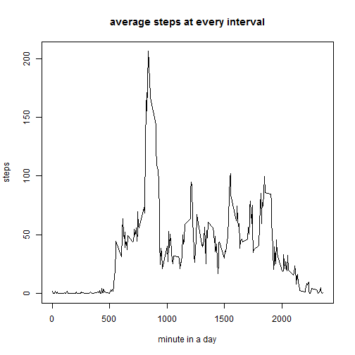

<!-- rmarkdown v1 -->

Reproducible Research Project 1
======================================

## Load the data

```r
unzip("activity.zip")
acdata <- read.csv("activity.csv")
```

## Plot total number of steps taken per day

```r
acdata_Daysum <- sapply(split(acdata$steps,acdata$date),sum,na.rm=TRUE)
hist(acdata_Daysum,breaks = 10, main = "histogram of daily steps",xlim = c(0,25000),xlab = "daily steps")
```


Mean of daily steps is: 

```r
mean(acdata_Daysum)
```

```
## [1] 9354.23
```
Median of daily steps is: 

```r
median(acdata_Daysum)
```

```
## [1] 10395
```

## Plot daily activity pattern

```r
acdata_5minave <- sapply(split(acdata$steps,acdata$interval),mean,na.rm=TRUE)
plot(names(acdata_5minave),acdata_5minave,type="l",xlab="minute in a day",ylab="steps",main="average steps at every interval")
```



The interval that includes most steps is:

```r
names(acdata_5minave[which(acdata_5minave == max(acdata_5minave))])
```

```
## [1] "835"
```

## Deal with missing values
the total number of NAs is:

```r
sum(is.na(acdata$steps))
```

```
## [1] 2304
```
the next thing is to substitute all NAs with the average steps of the same interval

```r
NAintervals <- acdata$interval[is.na(acdata$steps)]
newdata <- acdata
newdata$steps[is.na(acdata$steps)] <- acdata_5minave[as.character(NAintervals)]
```
now the total number of steps taken per day is summarized as this:

```r
newdata_Daysum <- sapply(split(newdata$steps,newdata$date),sum)
hist(newdata_Daysum,breaks = 10, main = "histogram of modified daily steps",xlim = c(0,25000),xlab = "daily steps")
```


Mean of modified daily steps is

```r
mean(newdata_Daysum)
```

```
## [1] 10766.19
```
Median of modified daily steps is

```r
median(newdata_Daysum)
```

```
## [1] 10766.19
```
removing NAs improve the mean by

```r
mean(newdata_Daysum)-mean(acdata_Daysum)
```

```
## [1] 1411.959
```
removing NAs improve the median by

```r
median(newdata_Daysum)-median(acdata_Daysum)
```

```
## [1] 371.1887
```

##Find differences between activity patterns in weekdays and weekends
create a new factor that defines the day as weekday or weekend

```r
dates <- as.Date(newdata$date)
newdata$day <- weekdays(dates) %in% c("ÐÇÆÚÁù","ÐÇÆÚÈÕ")
newdata$day <- as.factor(newdata$day)
levels(newdata$day) <- c("weekday","weekend")
```
plot activity patterns in weekdays and weekends

```r
newdata_5minave <- sapply(split(newdata$steps,list(newdata$interval,newdata$day)),mean)
names1 <- strsplit(names(newdata_5minave),split="\\.")
names1 <-t(as.data.frame(names1))
merged <- data.frame("average steps"=newdata_5minave,"interval"=as.integer(names1[,1]),"day"=as.factor(names1[,2]))
library(ggplot2)
qplot(interval,average.steps,data = merged,geom="line",facets=day ~ .)
```


